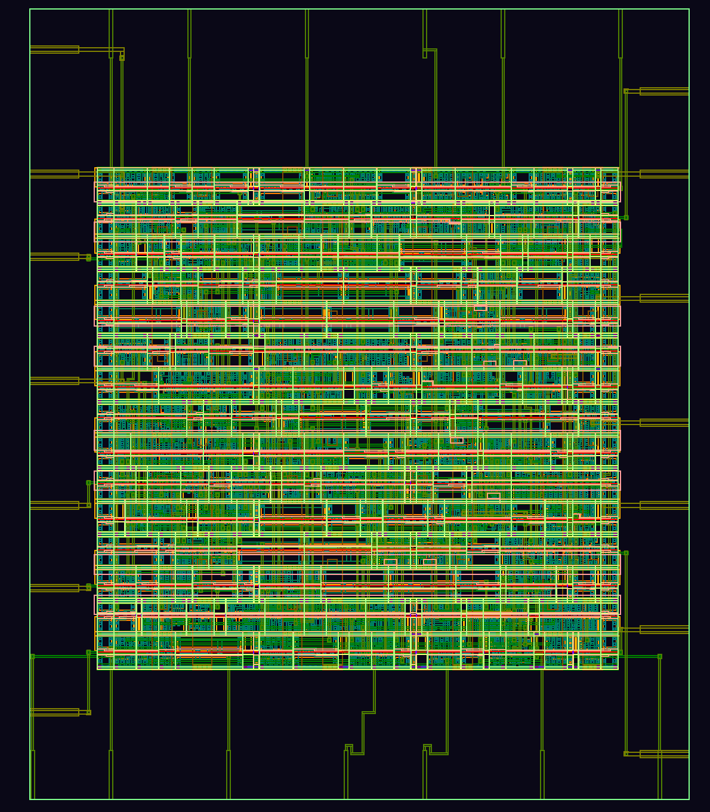

# 🔷 8-bit ALU RTL to GDSII using OpenLane

## 📌 Project Overview

This project demonstrates the complete **RTL to GDSII ASIC design flow** of an **8-bit Arithmetic Logic Unit (ALU)** using open-source tools.

The ALU is a fundamental component of a processor that performs arithmetic and logical operations on binary inputs.

---

## ⚙️ Design Specifications

| Parameter | Value            |
| --------- | ---------------- |
| Input A   | 8-bit            |
| Input B   | 8-bit            |
| Output    | 8-bit            |
| Control   | Operation Select |

### ✅ Supported Operations

* Addition (A + B)
* Subtraction (A - B)
* AND
* OR
* XOR

---

## 🛠️ Tools & Technologies Used

* **OpenLane** – Automated RTL to GDSII flow
* **OpenROAD** – Physical design
* **Magic VLSI** – Layout generation & DRC
* **KLayout** – Layout visualization
* **Sky130 PDK** – Open-source process design kit

---

## 🔄 ASIC Design Flow

The design was implemented using the complete digital ASIC flow:

1. RTL Design (Verilog)
2. Synthesis (Yosys)
3. Floorplanning
4. Placement
5. Clock Tree Synthesis (CTS)
6. Routing
7. Signoff (DRC/LVS checks)
8. GDSII Generation

---

## 📊 Results

* ✅ Flow completed successfully
* ✅ GDSII file generated
* ✅ Standard cell placement completed
* ✅ Routing completed
* ✅ Layout verified in KLayout

---

## 📸 Final GDS Layout



👉 This layout shows:

* Standard cell placement
* Multi-layer metal routing
* Power distribution network (VDD/VSS)

---

## 📁 Repository Structure

```
.
├── alu.v                  # RTL Design (Verilog)
├── config.json            # OpenLane configuration
├── runs/                  # OpenLane flow outputs
└── finalgds8bitalu.png    # Final GDS layout image
```

---

## 🚀 Key Learnings

* Complete understanding of **RTL → GDSII flow**
* Hands-on experience with **OpenLane & OpenROAD**
* Exposure to **physical design stages**
* Layout visualization using **KLayout**

---

## ⭐ Future Improvements

* Upgrade to **32-bit ALU**
* Add more operations (Shift, Compare, Multiply)
* Include timing & power reports
* Optimize area and performance

---


## 📌 Conclusion

This project successfully demonstrates the **end-to-end ASIC design flow**, converting a Verilog-based ALU into a manufacturable GDSII layout using open-source tools.
